---
author:
- Ugo Coveliers-Munzi (5007631)
- Aral de Moor (931604[^1] )
- Dani Rogmans (4885279)
- Jonathan van Zyl (5039738)
bibliography:
- main.bib
title: Segmenting
  quantitative criteria of the nucleus during mouse embryogenesis
---

# Introduction

During embryogenesis, cells repeatedly divide and dynamically change
their position in 3D space, resulting in a highly dynamic environment. A
number of studies have tried to acquire quantitative criteria such as
chromosome numbers, the synchrony of cell division, and the rate of
development, using image segmentation.

However, the existing solutions have abritrarily-determined
hyperparameters, and low segmentation accuracy due to suboptimal
analysis of spatiotemporal variations in the time-series data. With
regard to fluorescence microscopic imaging, a time series of
$\mathbb R^3$ images analysis is difficult as the fluorescence intensity
decreases along the z-axis, because the innermost part of the embryo is
not fully transparent. Furthermore, fluorophore fading causes decreasing
fluorescence intensity with time.

propose QCANet to generalise and improve segmentation accuracy of 3D
fluorescence microscopic images. They show that by decomposing the task
into separate convolutional neural networks (CNNs) responsible for
semantic and instance segmentation, they can outperform the 3D U-Net
baseline . In this post, we try to replicate their results and highlight
discrepancies in our reproduction ().

# Background

In the world of image processing, **semantic** segmentation refers to
labelling each voxel in an image with the correct class. E.g. in , the
cat, trees, sky and ground are shown. Whereas **instance** segmentation
partitions this class into distinct instances. E.g. divides a group of
people into individuals.

<figure>
  <figure id="fig:semantic-segmentation">
    
    <figcaption>Semantic Segmentation </figcaption>
  </figure>

  <figure id="fig:instance-segmentation">
    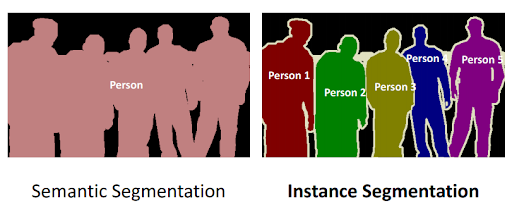
    <figcaption>Instance and Semantic Segmentation </figcaption>
  </figure>

<figcaption>Instance and Semantic Segmentation </figcaption>
</figure>

# Approach

<figure id="fig:segmentation-pipeline">
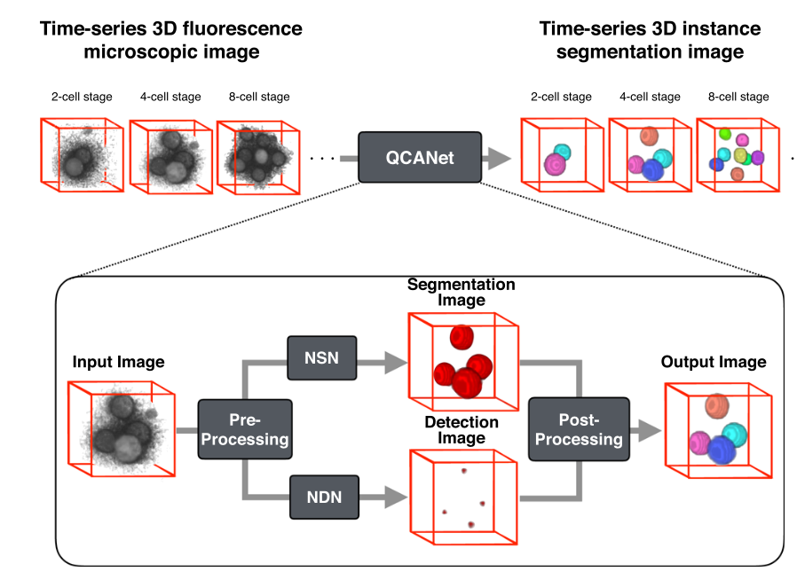
<figcaption>Segmentation Pipeline</figcaption>
</figure>

## QCANet Architecture

As shown in , QCANet consists of two subnetworks: *Nuclear Segmentation
Network* (NSN), and *Nuclear Detection Network* (NDN); responsible for
semantic segmentation and instance segmentation. These two networks
operate on the input individually, as seen in
<a href="#fig:segmentation-pipeline" data-reference-type="autoref"
data-reference="fig:segmentation-pipeline">[fig:segmentation-pipeline]</a>,
and their outputs are then combined in the post processing phase.

The primary objective of the NSN is to segment the nuclear regions (from
the background) in the images. In other words, it must detect all voxels
in the 3D image belonging to nuclei. This network outputs a binary mask
which covers all the detected nuclei in the 3D image by using a series
of 3D convolutional layers, max pooling layers aswell as deconvolution
and concatenation (an output from a previous downsampling layer is
concatenated with the output at the current, upsampled layer to ensure
that enough information is present when upscaling by adding back
features found in previous layers) layers based on the 3D U-NET
architecture . The final layer is then passed through a softmax function
to convert the numerical output into values between 0 and 1 denoting the
probability that the specific voxel represents part of a nucleus.

The NDN, on the other hand, learns to fully mask an image except for the
nuclear centres. This, when combined with the output of the NSN allows
the QCANet to perform instance segmentation on individual nuclei. As
with the NSN the architecture is based on the UNET-3D architecture and,
although many more layers are used, they can once again be broken down
into convolutional, max pooling, deconvolution and concatenation layers.
As in the NSN, the output is passed through a softmax function.

## Pre-Processing

As we are reproducing the authors’ works and aim to achieve similar
results, we emulated their exact pre-processing steps, which consist of
interpolation and mirror padding. First, we interpolate the given images
in the dataset. Depending on the microscopy approach and manufacturer,
3D images do not usually come in the form of a 1:1:1 ratio. In most
cases, interpolation is needed to account for higher z dimension ratios.
Another pre-processing step we perform is padding, which is done to
ensure that all images are of the same size. As the background around
the edges is slightly noisy and does not consist of strictly zero
values, mirror padding seems to be most appropriate to end up with a
consistent processed image. The QCANet authors further implement data
augmentation by flipping each image along its x and y dimensions, to
address their small training set size.

While data augmentation quadruples the training set size, it also makes
training take four times as long. Given the limited amount of time to
reproduce the project, and the extra training time overhead that data
augmentation added, we decided against following this pre-processing
step.

## Post-Processing

When the outputs of the the NSN and NDN are found, they need to be
combined. To complete QCANet’s cell-instance segmentation, marker-based
watershed divides the semantic segmentation region with the identified
centres as markers. An illustrative example of this process is shown in
<a href="#fig:watershed" data-reference-type="autoref"
data-reference="fig:watershed">[fig:watershed]</a>. Watershed ‘floods’
the central markers to accurately separate each nucleus; which helps in
preventing over-segmentation as the flood is less likely to be affected
by noise or artifacts.

<figure id="fig:watershed">
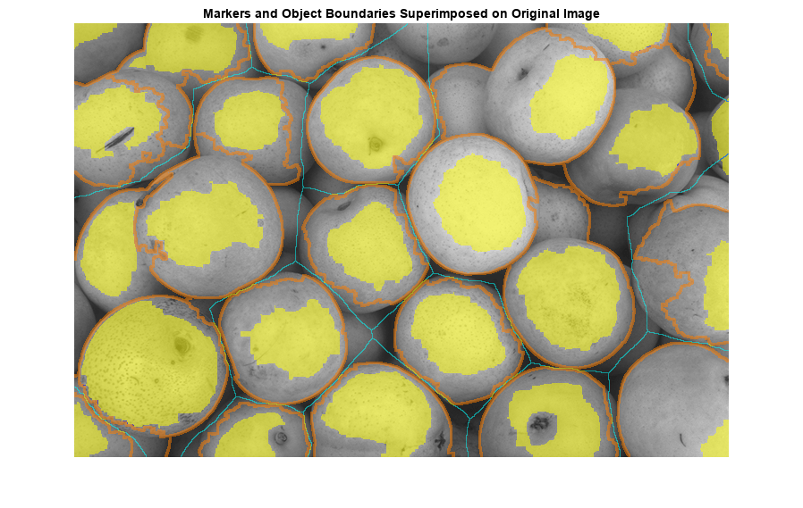
<figcaption>Marker Based Water Shed </figcaption>
</figure>

# Experiment Setup

## 3D Cell Dataset

The dataset consists of a series of frames, each one of them being a 3D
image of cells. The entire series of frames, when appended and watched
as a short film, shows the cells’ movements and their process of
splitting. The authors manually labelled a ground truth for the training
set at 11 time points in 11 mouse embryos.

Although our network was trained on this specific dataset, inference can
be done on all datasets with similar 3D images of cells. However, our
current codebase was only tested on `tiff` files, which are made of 2D
frames that are stacked on top of each other to create a 3D image.

## Training Setup

### Training Dice Loss

Both the NSN and NDN use dice loss. The Dice loss is a common loss
function for image segmentation which measures the overlap between the
predicted and target masks. In addition, the dice loss also solves
another important problem: the unbalance between the labels (the number
of pixels or voxels in the background and objects). In the segmentation
task, it is often a problem that labels (the number of pixels or voxels
in the background and objects) are not balanced; the use of dice loss
function as an objective function can suppress the influence of dataset
label imbalance.

For boolean data (0 or 1) the equation is as follows:

$$DL = 1- DC = 1 - \frac{2 \cdot TP}{|y| + |\hat{y}|}$$

### NSN and NDN Hyperparameters

The hyperparameters and optimization algorithm used for both networks
can be found in
<a href="#tab:hyper_summary" data-reference-type="autoref"
data-reference="tab:hyper_summary">[tab:hyper_summary]</a>. It must be
noted that the learning rate for the NSN was increased compared to the
paper as when using the learning rate described in the paper the loss
would not decrease while training.

|               | **NSN** | **NDN** |
|:--------------|--------:|--------:|
| Optimizer     |     SGD |     SGD |
| Learning rate |     0.1 |     0.1 |
| Batch Size    |       4 |       4 |
| num Epochs    |      80 |     150 |

The hyperparameters used to train each model

## Evaluation Metrics

The intersection of Union (IoU) is a metric which measures the overlap
between bounding boxes: one from the network and one the ground truth.
Conventionally this is used to measure false positive (FP) or false
negative (FN) rates, however it cannot identify instance segmentation as
it looks at all the cells.

$$IoU = \frac{TP}{TP + FP + FN}
    \label{eq:IoU}$$

Semantic Evaluation using Geodesic distances or SEG reviews the accuracy
of the image segmentation, as in how closely the segmentation from the
network matches that of the ground truth segmentation.
<a href="#eq:SEG" data-reference-type="autoref"
data-reference="eq:SEG">[eq:SEG]</a> is the mathematical notation for
SEG, in essence it is the sum over all ground truths, where for each one
the maximum IoU is computed with respect to the prediction of the
network, before being normalised by the total number of predictions.
Here it evaluates the absence of FNs.

$$SEG = \sum_{j}^{N_i} \frac{1}{N_i}  \max_i IoU(y_i, y_j^*)
\label{eq:SEG}$$

The Mean Unweighted Coverage (MUCov), is alike to SEG however in the
perspective of the predicted output, as shown by
<a href="#eq:MUCov" data-reference-type="autoref"
data-reference="eq:MUCov">[eq:MUCov]</a>. Here it evaluates the absence
of FPs.

$$MUCov = \sum_{i}^{N_j} \frac{1}{N_j}  \max_j IoU(y_i, y_j^*)
\label{eq:MUCov}$$

# Results

## Learning curves

The two figures below show the learning curves for the NSN and the NDN
training and validation loss per epoch, respectively.

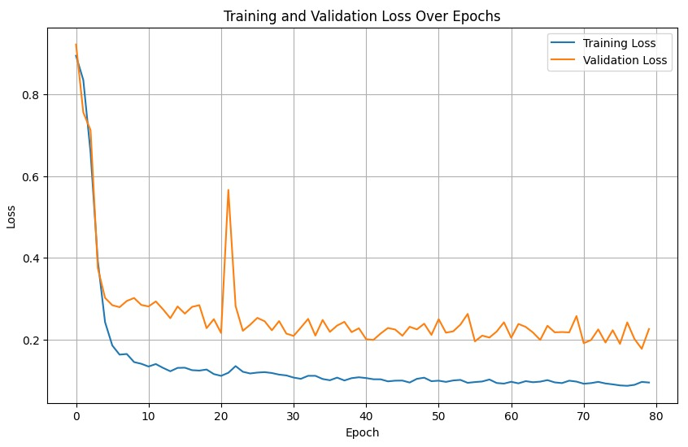
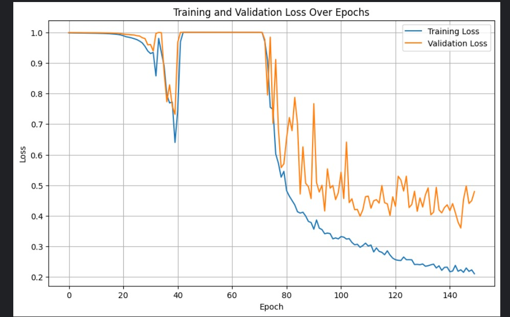

And below are the IoU scores over epochs for the NSN and NDN networks,
respestively.

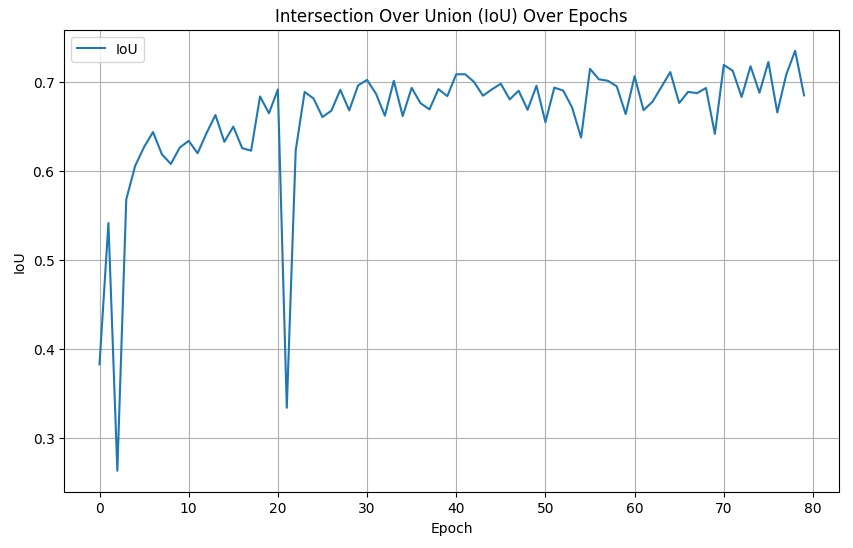
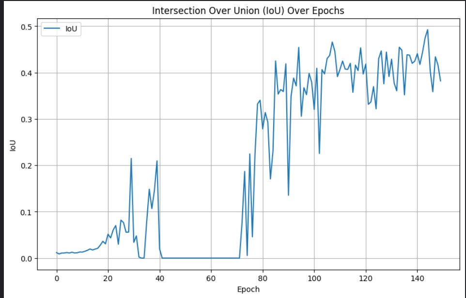

## Quantitative results compared to the original paper

After training our two networks and implementing the post-processing
steps, it was time to evaluate is against the original paper. For the
three previously mentioned metrics, we ran inference on our version of
the QCANet, over all images in the test set. The results, as compared to
the original QCANet, can be seen in .

|                    |  IoU  |  SEG  | MuCov |
|:------------------:|:-----:|:-----:|:-----:|
|  Original QCANet   | 0.746 | 0.710 | 0.721 |
| Our implementation | 0.503 | 0.155 | 0.079 |

Our network run and evaluated on three segmentation metrics vs. the
results of the original paper

Evidently, our results are far worse than those cited in the paper,
specifically for the SEG and MuCov metrics. Since the IoU for our
implementation is quite good and it is a semantic segmentation metric,
it is clear that the NDN is the component that is lacking. We discuss
the quantitative discrepancy further in .

Although we achieved much worse quantitative results than the original
paper, we are quite happy with the way the output images look, in a
visual sense. Here is an example of the pipeline running with all
intermediate images, for an image in the test set:

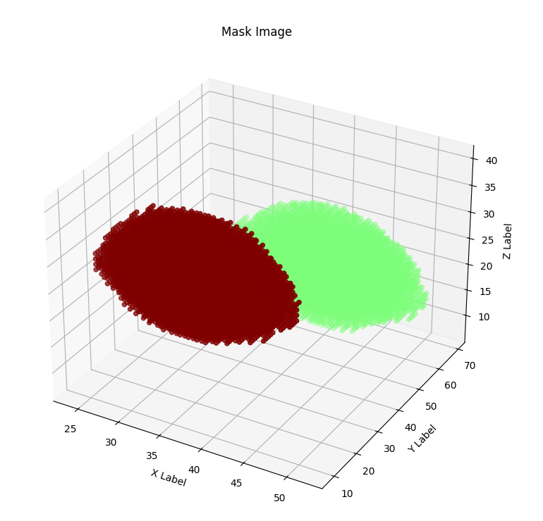
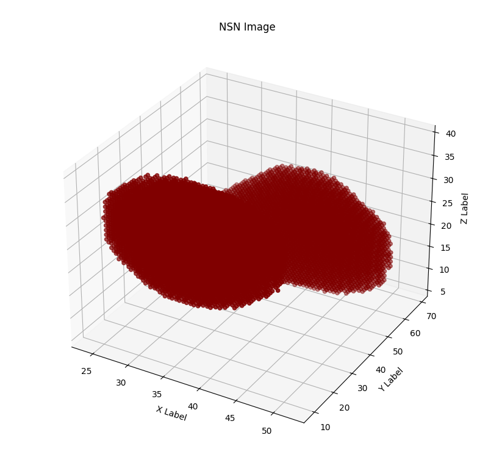
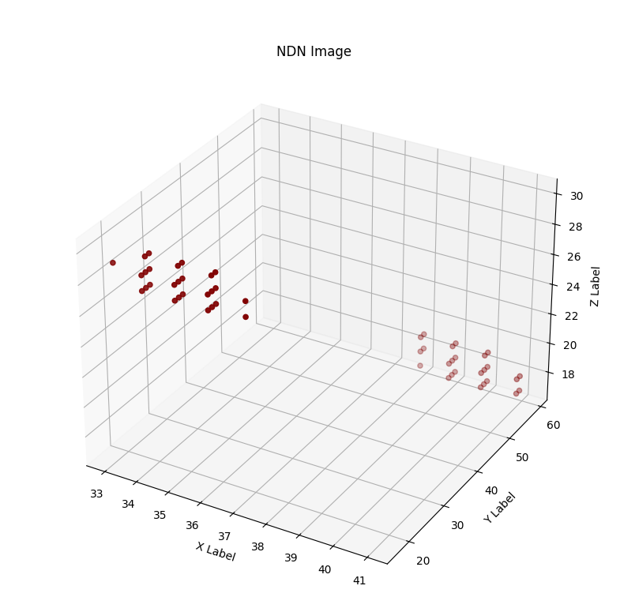
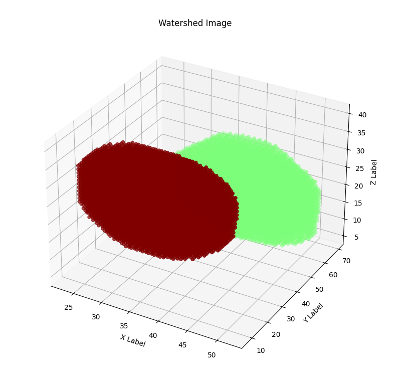
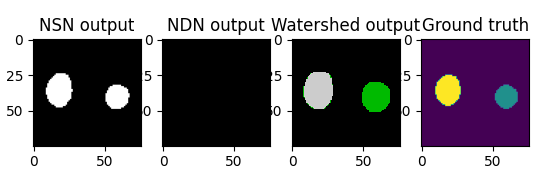

{width="\\textwidth"}
{width="\\textwidth"}
{width="\\textwidth"}

# Discussion

## Limitations

Although the QCAnet was correclty implemented, in the sense that we can
now perform satisfactory instance segmentation on 3D images of cells,
the quantitative results we achieved are not very close to the paper and
lack to varying degrees in all three metrics.

Implementing the NSN and the NDN were not daunting tasks, and we were
able to get the architectures correct within a few hours. The most time
consuming task was training, which required us to tweak parameters
multiple times, run multiple training runs that stop early, and
experiment until we got satisfactory training curves. Ironically,
claimed QCANet would relieve this heuristic, application-dependent
hyperparameter search.

Given that we had limited time and limited Kaggle credits to train, we
did not implement data augmentation, which would have quadrupled the
number of training instances in our dataset and most likely led to even
better results. This is most likely the biggest gap between our
implementation and the paper’s implementation. Further inconsistencies
that we took in order to get a working result instead of a very precise
one, are discussed in the following section ().

## Reproducibility Assessment

Although the paper tried to be detailed and precise with regards to
their approach, there are many changes we had to make to achieve
acceptable results. Many of their choices are not well motivated, and
reproducing their entire instance segmentation pipeline requires a lot
of trial and error.

For researchers trying to reproduce the approach proposed by the paper,
we suggest that they do not worry about the exact hyperparameters and
architectures they use. Instead, focus just on having two working
semantic segmentation networks - one for the cells and one for the cell
centers. The method of combining the output of two semantic segmentation
networks using marker-based watershed to perform instance segmentation
on 3D cells is indeed valid and it works well, but the hyperparameter
choice should be left to the person implementing and not copied from the
paper.

Leaving the choice of hyperparameters and architectures to the person
reproducing the method is especially important in the case of the NDN.
Here, the paper proposes a huge network that has too many steps in the
down (convolutional and max pool) direction and in the upwards
(convolution and upsample) directions. NDN has millions of extra
parameters than the standard 3D U-NET and it is likely that not all are
necessary. If the goal were to reproduce the approach to an acceptable
level and not the results specifically, we recommend a standard 3D U-NET
for the NDN.

The paper also uses strange hyperparameters that are not well motivated,
like a kernel size of 5 for the NDN which is not standard. The
architecture mentioned uses kernel sizes of 5, a padding of 1 and a
stride of 1 for each upsampling step. However, such a combination of
kernel sizes, padding and stride downsamples the input by 1 pixel on
each side after each step. In order to remedy this, the last
convolutional layer should have a padding of 4, but the paper shows a
padding of 0 for that layer. The architecture of the NDN is therefore
not even consistent, and we were left with the choice between changing
the kernel size to 3 or adding a padding of 4 to the last layer. In the
end, we changed the kernel size of each convolutional layer in the NDN
to 3.

Here is the full list of hyperparameters we had to specify differently
in order to get acceptable instance segmentation results:

- Optimizer: the paper proposed Adam as an optimizer for the NDN, which
  can be more stable than SGD thanks to the momentum and RMSprop
  mechanisms. We used SGD for the NDN, which was the only optimizer
  where the IoU was able to increase. This is most likely because the
  search space of the NDN - given its number of parameters - is massive,
  and the high variance that SGD suffers can actually be an advantage in
  this case.

- Learning rate: Instead of 0.01, we actually used a very high learning
  rate of 0.1. It seems as though the search space is very flat, and a
  lot of iterations are needed to reach areas of high gradients. A
  learning rate of 0.1 sped up the process of reaching points where the
  dice loss would decrease, at a certain IoU it was decreased to 0.02.

- NDN architecture: as previously mentioned, the NDN was modified to
  have a kernel size of 3 instead of a kernel size of 5.

- Data augmentation: unlike the paper, we perform no data augmentation
  because it makes the process of training too time consuming given the
  amount of time and Kaggle credits we had to train our models.

- Number of epochs: the NSN was starting to overfit very easily after 60
  or so epochs, and the test accuracy was not decreasing. We therefore
  opted for 80 epochs instead of 150.

As for comparing the results of the QCAnet with current
state-of-the-arts methods in instance segmentation, only Mask-RCNN can
be used in a fair comparison using the metrics stated. The paper
unfairly compares their approach to the traditional 3D U-NET, which is
designed for semantic segmentation and not instance segmentation.

# Conclusion

The authors of QCAnet propose a great novel approach to instance
segmentation that combines two semantic segmentation networks and
post-processing in the form of marker-based watershed, and we were able
to reproduce the method successfully. However, a lot of choices had to
be made by us instead of blindly following the choices of the authors,
and an exact reproduction is therefore not very easy to achieve.

<!-- # Task Distribution

| **Member** | **Tasks**                                                                                           |
|:-----------|:----------------------------------------------------------------------------------------------------|
| Dani       | Building NSN and NDN network, training them, implementing pre-processing in Kaggle, dice loss. Blog |
| Ugo        | Pre-Processing, Metrics, Watershed, Graph visualisation. Blog                                       |
| Jonathan   | Pre-Processing, Metrics, Training NDN. Blog. Help with watershed                                    |
| Aral       | Poster and Blog. Original QCANET implementation & original metrics attempt.                         |

Tasks assigned to each team member

[^1]: Employee Number -->
